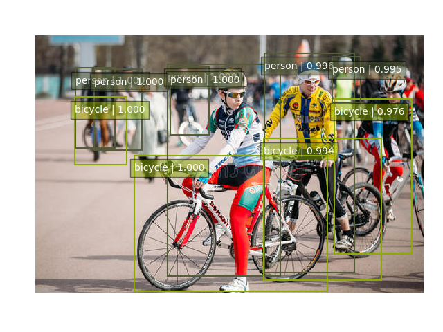
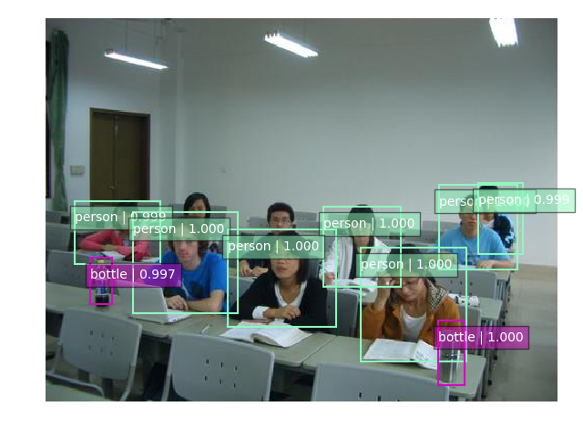
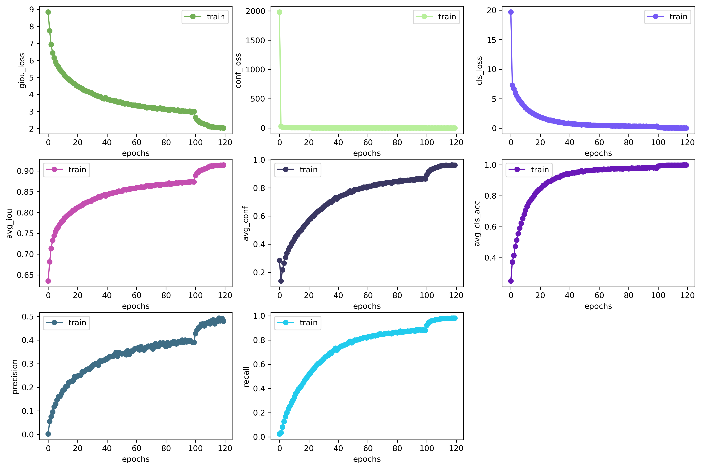

# YoloV3
a simple PyTorch implementation of YoloV3 

[](https://www.python.org/)
[](https://github.com/pytorch/pytorch)
[](https://github.com/numpy/numpy/)
[](https://github.com/opencv/opencv)
[](https://developer.nvidia.com/cuda-downloads)

## Usage

### 1.prepare dataset

The folder structure is as follows
```
├── data
│   ├── dataset # put your dataset here, and name it as follows: VOC2007_trainval
│   ├── ...    
│
├── results # log files
├── weights # model weights
├── checkpoints
├── main.py # training code
```

### 2.train

```bash
python main.py --model_name choose_your_model_name  # yon can see more arguments in train.py
```

## Resutls







## Reference

[YoloV3 by ultralytics](https://github.com/ultralytics/yolov3)